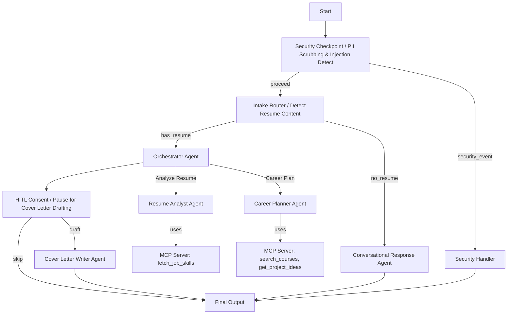

# Project Submission Writeup: career-coach

## Problem Statement

Transitioning careers or seeking new jobs is a complex, multi-step process for candidates. Job seekers often struggle to:
1. Objectively identify how their current skills match the requirements of their target roles.
2. Find high-quality, targeted learning paths (courses) and build appropriate portfolio projects to bridge their experience gaps.
3. Tailor their cover letters for specific job applications without exposing sensitive PII.

`career-coach` solves this by automating the entire analysis, planning, and drafting lifecycle using a secure, multi-agent AI workflow.

---

## Solution Architecture

The system utilizes a structured ADK Workflow with input validation, modular agent routing, and a human-in-the-loop (HITL) consent gate before generating user-facing artifacts.

---

## Concepts Used

This project makes extensive use of the Google ADK and Agents framework components:

1. **ADK Workflow**: The entire process is structured as an ADK `Workflow` in [`app/agent.py`](file:///c:/Users/BIPIN%20SRIVASTAVA/OneDrive/Documents/AIAgents/adk-worksspace/career-coach/app/agent.py#L253) mapping nodes and edges to define execution paths.
2. **LlmAgent**: Used for individual specialized roles. For example:
   - `resume_analyst` in [`app/agent.py`](file:///c:/Users/BIPIN%20SRIVASTAVA/OneDrive/Documents/AIAgents/adk-worksspace/career-coach/app/agent.py#L55)
   - `career_planner` in [`app/agent.py`](file:///c:/Users/BIPIN%20SRIVASTAVA/OneDrive/Documents/AIAgents/adk-worksspace/career-coach/app/agent.py#L67)
   - `conversational_agent` in [`app/agent.py`](file:///c:/Users/BIPIN%20SRIVASTAVA/OneDrive/Documents/AIAgents/adk-worksspace/career-coach/app/agent.py#L108)
3. **AgentTool**: Wrapping LLM sub-agents as tools in [`app/agent.py`](file:///c:/Users/BIPIN%20SRIVASTAVA/OneDrive/Documents/AIAgents/adk-worksspace/career-coach/app/agent.py#L101-L102) so the orchestrator can call them dynamically.
4. **MCP Server**: Implements a Model Context Protocol server in [`app/mcp_server.py`](file:///c:/Users/BIPIN%20SRIVASTAVA/OneDrive/Documents/AIAgents/adk-worksspace/career-coach/app/mcp_server.py) providing specialized tools (`search_courses`, `get_project_ideas`, `fetch_job_skills`).
5. **Security Checkpoint**: Implemented as the `security_checkpoint` workflow node in [`app/agent.py`](file:///c:/Users/BIPIN%20SRIVASTAVA/OneDrive/Documents/AIAgents/adk-worksspace/career-coach/app/agent.py#L110) to scrub user data and block prompt injection attacks.
6. **Agents CLI**: Used for scaffolding, local testing (`playground`), and automated evaluation checks.

---

## Security Design

The security architecture of `career-coach` prioritizes protecting candidate data and securing LLM execution:

1. **PII Scrubbing**: Regular expression-based filters redact emails and phone numbers from user resumes before processing. This prevents leaking personal details to third-party APIs or telemetry logs.
2. **Prompt Injection Detection**: Scans user input for adversarial instructions (e.g., "ignore previous instructions", "bypass security"). Any detection immediately redirects the flow to the `security_handler` and generates a critical alert log.
3. **Input Length Limits**: Restricts incoming text length to `10000` characters. This mitigates Denial of Service (DoS) and memory exhaustion vectors.
4. **Structured Audit Logs**: Every decision triggers a JSON-structured audit log utilizing severity levels (`INFO`, `WARNING`, `CRITICAL`), ensuring a comprehensive logs history for compliance.

---

## MCP Server Design

The Model Context Protocol (MCP) server enables the agents to interact with external/domain-specific database resources:

- **`fetch_job_skills`**: Takes a job title (e.g. 'Backend Engineer') and returns lists of required skills. Used by the `resume_analyst` to discover what a candidate is missing.
- **`search_courses`**: Retrieves suggested online courses (Coursera, Udemy, etc.) for a specific skill gap. Used by the `career_planner`.
- **`get_project_ideas`**: Generates real-world portfolio project ideas tailored to a target role. Used by the `career_planner`.

---

## Human-in-the-Loop (HITL) Flow

A significant design decision in the career planning process is when and how to generate application materials. Drafting a cover letter requires candidate consent since it is directly user-facing.

- **Pause Node**: The `hitl_consent` node (implemented in [`app/agent.py`](file:///c:/Users/BIPIN%20SRIVASTAVA/OneDrive/Documents/AIAgents/adk-worksspace/career-coach/app/agent.py#L182)) stores the resume analysis and planning results in the workflow context state.
- **`RequestInput` Interruption**: The workflow yields a `RequestInput` object requesting consent ("Would you like me to draft a tailored cover letter?").
- **Routing Decision**: If the user responds "yes" (`Proceed`), the flow routes to `run_cover_letter_writer` to generate the letter. If "no", it skips the draft and directly presents the career planning report.

---

## Demo Walkthrough

### 1. Conversational Onboarding
- **Action**: User says `"Hi!"`
- **Path**: Routed to `conversational_response`.
- **Result**: The agent introduces itself, lists its features, and politely asks the user to paste their resume.

### 2. Resume Gap Analysis & Course Recommendations
- **Action**: User pastes their resume.
- **Path**: Routed to `run_orchestrator` → calls `resume_analyst` and `career_planner`.
- **Result**: The system queries the MCP server, identifies missing skills (e.g. Machine Learning), and generates course suggestions. It pauses and asks the user: `"Would you like me to draft a tailored cover letter based on this analysis? Reply 'yes' to proceed, or 'no' to finish."`

### 3. Cover Letter Drafting
- **Action**: User replies `"yes"`.
- **Path**: Resumes flow to `run_cover_letter_writer` node.
- **Result**: Generates a professional cover letter custom-tailored to the target role and the user's identified strengths.

---

## Impact / Value Statement

`career-coach` significantly democratizes career development resources by providing:
- **Scalable Coaching**: Job seekers receive instant, specialized analysis of their profiles without needing expensive recruiters.
- **Actionable Planning**: Suggesting actual courses and projects instead of vague advice ensures users have a clear path to transition.
- **User Privacy**: Preserving privacy through redacting PII makes it suitable for deployment in enterprises where data safety is paramount.
